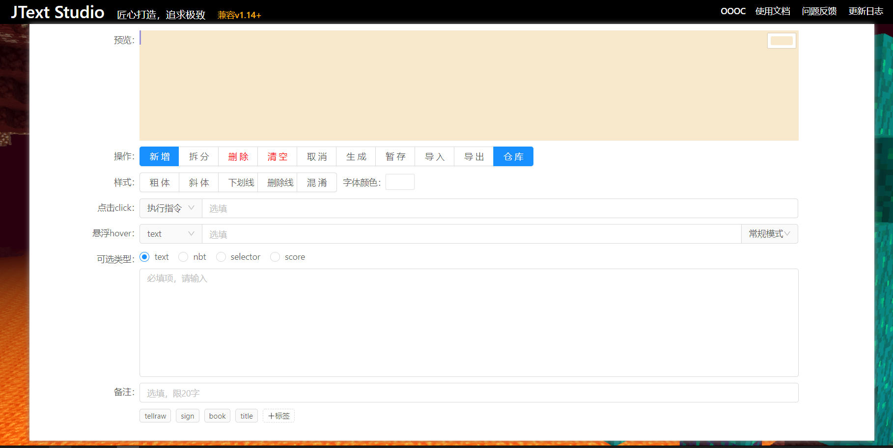
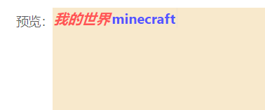
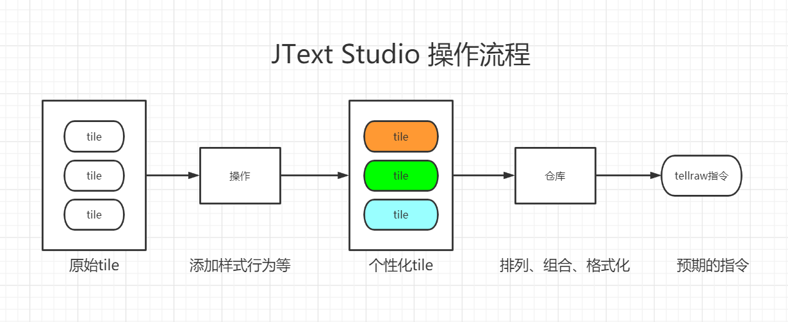
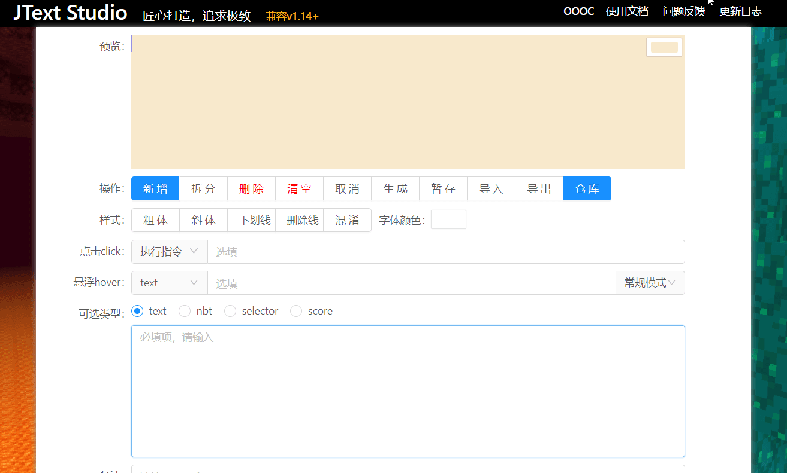
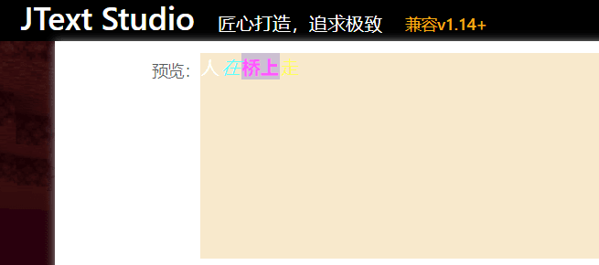
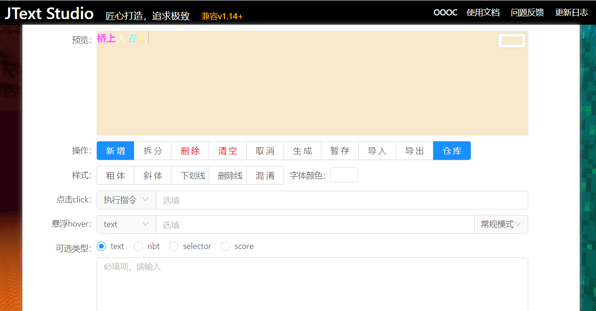
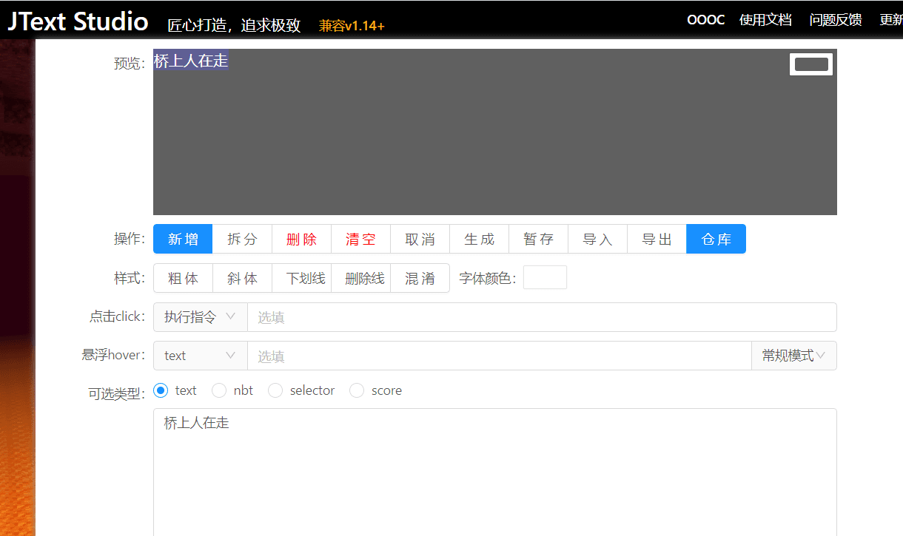
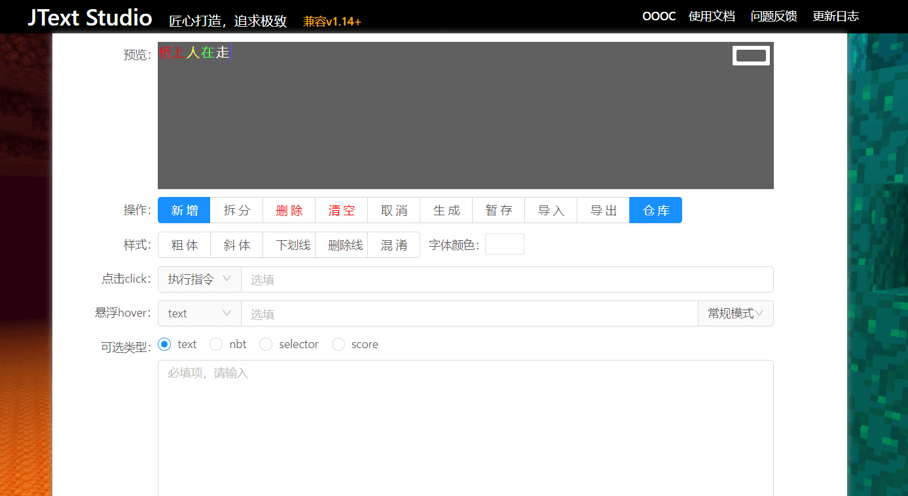
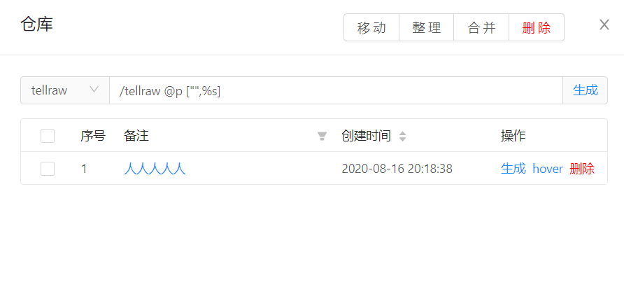

## 概览

### 一图胜千言

### 设计思想

这里我要罗嗦一下，其实现有的tellraw生成器有很多了，那为什么还要"造轮子"呢？原因多方面的，但总归是现有的不那么好用，不论界面设计的好与坏，但**本质交互设计上就不友好**。

个人认为理想的tellraw生成器应该像使用word编辑文稿一样，不过由于技术难题和一些别的原因放弃那种设计了。即便如此，本人也是尽量的做到便捷、实用，快捷键等功能一个也不少。

好的回归正题，你需要掌握以下信息

`tile` ——设计思想是这样的，每点击「新增」就是一个`tile`，可以对tile添加样式和功能，比如下图中`我的世界` `minecraft` 各是一个`tile`，它们分别有各自的样式。当然也可以图添加点击事件或鼠标选停效果（详细请翻看对应章节）。也就是你预期有多少中样式就要添加多少个`tile`即可。

` tile group`——页面上看到的「预览」就是一个`tile group` 也就是由多个`tile`组成的，它扮演的角色很重要，决定了你想要的结果，因此要格外注意它。

其实聪明的你已经发现了，不论是游戏中的tellraw，title还是book，sign，不论它多么复杂，都是由一个个`tile`组成的，因此掌握如何设计`tile group`就掌握了minecraft中的tellraw，也就掌握了JText Studio的使用，nice！。

### 操作流程

## 功能特色

没有那个软件是完美的，每个软件都有自己的特点，多数人使用这个软件就是某个特定的功能**契合**了你当前的需求。但就tellraw生成器而言「所见即所得」必须是标配的功能，就不多说了。除此之外，此软件还有以下几个特点：

- 离线存储
- 一屏展示
- 模板化、模块化
- 丰富的快捷操键
- 强大的编辑功能
- 数据集中处理，多次利用

以上特点基本上是其他软件没有的，也是软件的核心功能，可以很大程度上**改善用户体验，提高开发效率**，希望能解决你的**痛点**。

## 交互说明

### 预览窗格

预览窗格可以把用户当前操作呈现出来，实时预览，达到所见即所得的效果，视图的效果和游戏基本一致，需要注意的是，游戏中的混淆在视图上是以上划线表示的。不仅如此，这里对预览窗格做了加强，不仅仅是展示功能，可以做到交互，这才使得此软件具有**一屏展示**的特点。具体功能如下：

- 鼠标点选操作：鼠标点击`tile`即可，点击后会有高亮显示，同时下方的功能控件会切换成当前`tile`的状态方便查看和二次调整。
- 鼠标拖动操作：拖动调换`tile`的排列顺序。
- 更换背景色：右上角有个拾色器，可以点击更换背景颜色，方便查看不同背景下的显示效果。

### 操作栏

操作栏是处理当前`tile`的功能性按钮，通过鼠标点击使用，但多数情况可以使用相应的快捷键，详细见**快捷键**

- `添加`：当你完成一个`tile`后想要继续添加一个样式不一样的tile时可以点击此按钮
- `拆分`：强大的功能，替代了「插入」「克隆」功能，按回车符将其拆分为多个tile
- `删除`：当你不想要某个tile时，选中一个tile可以将其移除，不可恢复
- `清空`：当你不想要当前这个工程时，可以点击此按钮，所有的tile都会被删除，不可恢复
- `取消`：可以取消`tile`的高亮
- `生成`：生成一段可用的JText nbt
- `暂存`：将当前`tile group`保存，可以点击`仓库`查看
- `导入`：可以把合法的json文本解析（合法指通过JText Studio生成的json文本）
- `导出`：可以把当前的内容保存为json文本，作为模板
- `仓库`：打开仓库管理页面

### 样式

在此软件中，将样式归纳为6项，分别对应JText中的6个字体样式nbt标签，即加粗、斜体、下划线、删除线、混淆和字体颜色，并设置快捷键，详细见**快捷键**

### 事件

点击事件：分5种，`open_url` `run_command` `change_page` `suggest_command` `copy_to_clipboard`

悬浮事件：分3种 `text` `block` ` entity` 注意：当类型选择`text`时，会有两种模式，默认**常规模式**是以普通文本显示，如果是要以JText格式显示，请选择**高级模式**

### 可选类型

在一个tile中仅能选择一个可选类型，即`text` `nbt` `selector` `score`四个选项是互斥的，其实就是对应JText中相应的nbt标签。

- `text`：默认使用当前项，普通的文本模式，使用最普遍

- `nbt`：显示nbt，新增解析功能，使用游戏中使用F3 + i复制nbt数据粘贴进行解析，辅助用户填写nbt路径。妈妈再也不用担心我不会nbt路径了~

- `selector` ：显示选择器

- `score`： 显示积分板分数

关于显示效果：选择`text`显示对应的文本，其他由于无法确定内容，以[@ + 类型]的形式作为占位符

### 备注

作为对当前`tile group`的说明，类似注释（检索时使用的）同时也作为输出面板表格中的一列，用于区分不同的`tile`，如果不填写，取第一个`tile`中的文字。

### 仓库

用于管理暂存的项目，它就像是一个工厂一样把"原料"制作成预期的"产品"，原料就是`tile group`。既可以格式化命令（内预制了4种常用的指令），也可以对"原料"增删改查等。

#### 预置命令的使用

「tellraw」「sign」「book」「title」勾选列表中的tile然后点击对应的按钮即可获得相应的指令。当然，你也可以根据实际的使用需求修改输出模板，`%s`就是输出的占位符（注意仅替换第一个%s）

#### 操作按钮

- `移动`：对表格中的数据进行调整，选择至少一项，每次点击会向上（前）移动一位，移动的目标对象是选择中的第一项和最后一项之间的所有项
- `整理`：对表格中的数据进行调整，选择至少两项，会把选择项按第一项的位置排列，使得选择项之间没有"空隙"
- `合并`：对表格中的数据进行调整，选择至少两项，会把选择的项合并，位置按第一项
- `编辑`：对当前行二次编辑
- `删除`：删除当前行，如果工程使用当前行，也会被清除
- `生成`：生成json text字符串
- `hover`：用于hover的高级模式，即以json解析字符串，使得hover的文字具有格式

> 注意，这里输出不会做功能校验，如tile的clickEvent选择的是跳转页码，但是您生成的是告示牌，系统不会产成警告，所以请保证您tile的正确性。

### 快捷键

  - `shift + enter` 添加一个`tile`，相当于点击按钮[新增]
  - `enter` 换行
  - `escape` 取消选中状态的`tile`，相当于点击按钮[取消]
  - `ctrl + delete` 删除选中状态的`tile`，相当于点击按钮[删除]
  - `ctrl + B` 加粗，相当于点击按钮[粗体]
  - `ctrl + I` 斜体，相当于点击按钮[斜体]
  - `ctrl + U` 下划线，相当于点击按钮[下划线]
  - `ctrl + shift + S` 删除线，相当于点击按钮[删除线]
  - `ctrl + O` 混淆，这里暂时用上划线替代，相当于点击按钮[混淆]
  - `ctrl + G` 生成代码，相当于点击按钮[生成]
  - `ctrl + P` 打开输出面板，相当于点击按钮[输出]
  - `alt + ArrowUp `上一个颜色
  - `alt + ArrowDown`  下一个颜色
  - `alt + ArrowLeft` 选中前一个`tile`
  - `alt + ArrowLeft` 选中后一个`tile`
  - `ctrl + K`  拆分，相当于点击按钮[拆分]
  - `ctrl + S` 暂存功能，相当与点击按钮「暂存」

## 举例

### 1. 连续创建tile

即使没有连续的输入，JText Studio也可以实现快速创建。

技巧：使用`shift + enter`完成新建`tile`的操作，配合修改样式的快捷键使用更佳

### 2. 调整tile顺序

由于没有连续书写的能力，所有开发了此功能，使用鼠标拖放即可
技巧：鼠标点选一个`tile`不放，拖拽到另一个`tile`上，出现**高亮**后松开鼠标即可

### 3. 更换背景色

很多时候会字体颜色为浅色不太容易看出效果，这个时候右上角的更换背景色会帮你大忙的

技巧：点击色块，在拾色器里调整即可

### 4. 拆分tile

有的时候考虑不到位，想要分多个样式展示

技巧：把需要调整的`tile`文本用回车符分开，点击`拆分`按钮，也可以使用快捷键`ctrl + k`

### 5. 离线存储与二次编辑

很多时候因为一些原因需要暂时当前的工程，这个时候**离线存储**就非常有必要，`仓库`是查看离线存储的地方，并且`仓库`中提供了预览和二次编辑的功能

技巧：点击暂存`按钮`完成保存操作（快捷键`ctrl+s`），点击仓库打开面板（快捷键`ctrl+p`） ，鼠标在悬浮在`备注`一列可以预览工程，点击后可以二次编辑此工程

### 6. 格式化输出

**minecraft**中用到Json text的地方有`tellraw` `sign` `title` `book` 仓库中预置了这四种类型，并且可是自定义输出

技巧：在仓库中选择下拉框中对应的类型，勾选表格中的项，然后点击生成即可，当然可以自定义输出，`%s`为数据占位符（仅替换第一个%s）

备注：多数功能都做了引导，可自行探索

## 特殊说明

由于软件是个人开发，因此没有特意对IE浏览器做适配，请使用**非IE内核**的浏览器。

如果文章有错误，望指正